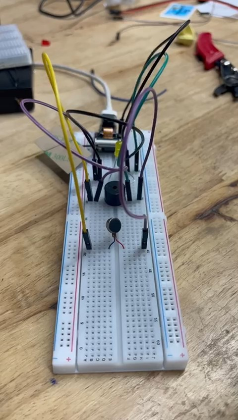
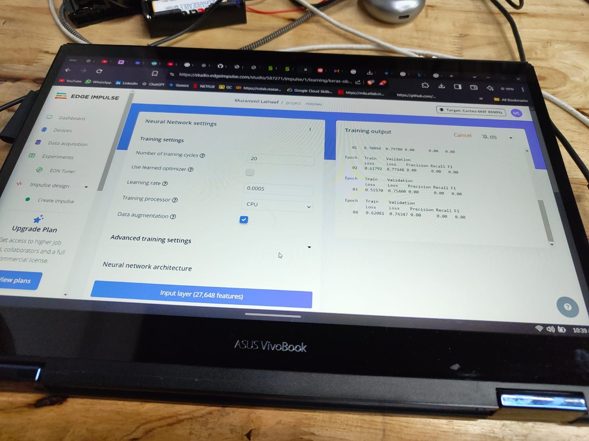

<div align="center">


# Pathfinder

### A TinyML-powered navigation assistant for visually impaired individuals

[](LICENSE)
[](https://www.seeedstudio.com/XIAO-ESP32S3-p-5627.html)
[](src/main.ino)
[](https://edgeimpulse.com/)
[](https://tinkerhub.org/)

</div>

---

## 📖 Table of Contents

- [Overview](#-overview)
- [Features](#-features)
- [How It Works](#-how-it-works)
- [Hardware](#-hardware)
  - [Bill of Materials](#bill-of-materials)
  - [Wiring](#wiring)
- [Software Setup](#-software-setup)
  - [Prerequisites](#prerequisites)
  - [Flash the Firmware](#flash-the-firmware)
  - [Edge Impulse ML Model](#edge-impulse-ml-model)
- [Gallery & Demo](#-gallery--demo)
- [Project Structure](#-project-structure)
- [Team](#-team)
- [License](#-license)

---

## 🌟 Overview

**Pathfinder** is a compact, wearable/handheld device that detects obstacles and recognizes objects in real time, providing immediate feedback through **vibration patterns**, **buzzer alerts**, and optional audio cues — enabling visually impaired users to navigate their surroundings more confidently and independently.

Built in **24 hours** at the TinyML Hackathon hosted by [TinkerHub](https://tinkerhub.org/) at TinkerSpace, it demonstrates how tiny machine learning (TinyML) can power real-world assistive technology on ultra-low-cost embedded hardware.

> **Core insight:** By running inference directly on the microcontroller (no cloud, no phone, no internet), Pathfinder achieves sub-100ms response times with no privacy concerns — critical for safety-critical assistive devices.

---

## 🚀 Features

| Feature | Description |
|---|---|
| 🔊 Obstacle detection | Real-time distance measurement via HC-SR04 ultrasonic sensor |
| 🤖 Object recognition | TinyML inference using Edge Impulse model, running locally on-device |
| 📳 Haptic feedback | Vibration motor pulses — rate increases as obstacles get closer |
| 🔔 Buzzer alerts | Immediate high-urgency alert when obstacle enters danger zone (<20 cm) |
| 🎙️ Audio cues | Optional voice/tone cues for identified object classes |
| 🔋 Portable | Runs on a small LiPo battery; low power design for extended field use |
| ☁️ Offline-first | No Wi-Fi or cloud dependency — works anywhere |

---

## ⚙️ How It Works

```
┌──────────────┐      distance reading      ┌──────────────────────┐
│  HC-SR04     │ ─────────────────────────▶ │                      │
│  Ultrasonic  │                            │   XIAO ESP32S3       │
│  Sensor      │                            │                      │
└──────────────┘                            │  ┌────────────────┐  │
                                            │  │ TinyML Model   │  │
                                            │  │ (Edge Impulse) │  │
                                            │  └────────────────┘  │
                                            │         │            │
                          ┌─────────────────┼─────────┘            │
                          │                 │                      │
                          ▼                 ▼                      │
                   ┌──────────┐      ┌──────────┐                  │
                   │ Vibration│      │  Buzzer  │                  │
                   │  Motor   │      │  Alert   │                  │
                   └──────────┘      └──────────┘                  │
                                            └──────────────────────┘
```

1. The ultrasonic sensor continuously measures distance to objects ahead.
2. If an obstacle is detected within **50 cm**, the vibration motor activates with a pattern proportional to proximity.
3. If the obstacle enters the **danger zone (<20 cm)**, the buzzer fires an immediate alert.
4. Simultaneously, the TinyML model (if deployed) classifies the detected object and can trigger additional audio feedback.

---

## 🔧 Hardware

### Bill of Materials

| Component | Qty | Purpose | Notes |
|---|---|---|---|
| [XIAO ESP32S3](https://www.seeedstudio.com/XIAO-ESP32S3-p-5627.html) | 1 | Main MCU | Built-in BT + Wi-Fi |
| HC-SR04 Ultrasonic Sensor | 1–3 | Distance measurement | Range: 2–400 cm |
| Vibration Motor (coin type) | 1–2 | Haptic feedback | 3V DC, off-weight |
| Piezoelectric Buzzer | 1 | Audio alert | 3–5V passive |
| LiPo Battery | 1 | Power supply | 3.7V, 500 mAh+ recommended |
| Battery charger/shield | 1 | Charging circuit | Compatible with XIAO |
| Resistors | ~4 | Motor / sensor protection | 220 Ω, 10 kΩ |
| Jumper wires | ~20 | Connections | M–M, M–F |
| Breadboard / PCB | 1 | Prototyping | Half-size breadboard ok |

For the complete sourcing list, see [`hardware/components.md`](hardware/components.md).

### Wiring

```
XIAO ESP32S3 Pin   →   Component
──────────────────────────────────────────
5V                 →   HC-SR04 VCC
GND                →   HC-SR04 GND, Motor –, Buzzer –
D2  (GPIO2)        →   HC-SR04 TRIG
D3  (GPIO3)        →   HC-SR04 ECHO
D5  (GPIO5)        →   Vibration Motor + (via transistor/MOSFET)
D6  (GPIO6)        →   Buzzer +
```

> ⚠️ **Important:** Use a small NPN transistor (e.g., 2N2222) or MOSFET between the motor pin and the motor. The ESP32S3 GPIO pins are **not rated** for the motor's current draw.

For the full schematic, see [`hardware/schematic.md`](hardware/schematic.md).

**Prototype breadboard build:**

<div align="center">

</div>

---

## 💻 Software Setup

### Prerequisites

1. **Arduino IDE 2.x** — [Download here](https://www.arduino.cc/en/software)
2. **XIAO ESP32S3 board package** — Add this URL in Arduino IDE → Preferences → Board Manager URLs:
   ```
   https://raw.githubusercontent.com/espressif/arduino-esp32/gh-pages/package_esp32_index.json
   ```
   Then install: `Boards Manager → esp32 by Espressif Systems`
3. **NewPing library** — `Sketch → Include Library → Manage Libraries → search "NewPing"`

### Flash the Firmware

```bash
# 1. Clone the repo
git clone https://github.com/mizhab-as/Pathfinder.git
cd Pathfinder-V1

# 2. Open the sketch in Arduino IDE
#    File → Open → src/main.ino

# 3. Select board & port
#    Tools → Board → esp32 → XIAO_ESP32S3
#    Tools → Port → (your COM port)

# 4. Upload
#    Click the Upload button (→) or press Ctrl+U
```

After uploading, open **Serial Monitor** at `115200 baud` to see live distance readings and debug output.

### Edge Impulse ML Model

The TinyML object recognition model is trained on [Edge Impulse](https://edgeimpulse.com/). To deploy:

1. Train your own model at [studio.edgeimpulse.com](https://studio.edgeimpulse.com/)
2. Deploy as an **Arduino library** (Deployment → Arduino library)
3. Install the downloaded `.zip` in Arduino IDE: `Sketch → Include Library → Add .ZIP Library`
4. Uncomment the Edge Impulse lines in `src/main.ino` (marked with `// Uncomment if you have access...`)

For a full walkthrough, see [`src/model_deployment/README.md`](src/model_deployment/README.md).

**Edge Impulse training in action (hackathon night):**

<div align="center">

</div>

---

## 🎥 Gallery & Demo

### Device in Action

The clip below shows Pathfinder detecting an obstacle in real time — watch the vibration motor and buzzer respond as the object enters the warning and danger zones.

> **▶️ [Click here to watch the demo video](docs/images/demo.mp4)**
> *(Download or view raw on GitHub — video preview isn't supported inline in markdown)*

<div align="center">

| Hardware build | Edge Impulse training |
|---|---|
|  |  |

</div>

---

## 📁 Project Structure

```
Pathfinder/
├── src/
│   ├── main.ino                        # Main Arduino firmware
│   └── model_deployment/
│       └── README.md                   # Edge Impulse model deployment guide
├── hardware/
│   ├── components.md                   # Bill of Materials (BOM)
│   └── schematic.md                    # Wiring diagram & connections
├── docs/
│   └── images/
│       ├── 1735728053423.jpg           # Hero device photo
│       ├── hardware-build.jpg          # Prototype breadboard photo
│       ├── edge-impulse-training.jpg   # ML training screenshot
│       └── demo.mp4                    # Live obstacle detection demo
├── .gitignore                          # Build & OS artifact exclusions
├── CONTRIBUTING.md                     # How to contribute
├── CHANGELOG.md                        # Version history
├── LICENSE                             # MIT License
└── README.md                           # You are here
```

---

## 👥 Team

Built by **Team VYSE** at the TinkerHub TinyML Hackathon 2024 (24-hour sprint at TinkerSpace):

| Name | Role |
|---|---|
| Jeevan Joseph | Hardware & firmware |
| Muzammil Latheef Seedi | ML model training |
| **Mizhab A S** | Firmware & integration |
| Muhammed Irfan Nazar | Hardware design |

---

## 🤝 Contributing

Contributions are welcome! Please read [`CONTRIBUTING.md`](CONTRIBUTING.md) for guidelines on how to open issues, suggest features, or submit pull requests.

---

## 📄 License

This project is licensed under the **MIT License** — see the [`LICENSE`](LICENSE) file for details.

---

<div align="center">
  <sub>Built with ❤️ in 24 hours · TinkerHub TinyML Hackathon 2024 · TinkerSpace</sub>
</div>
